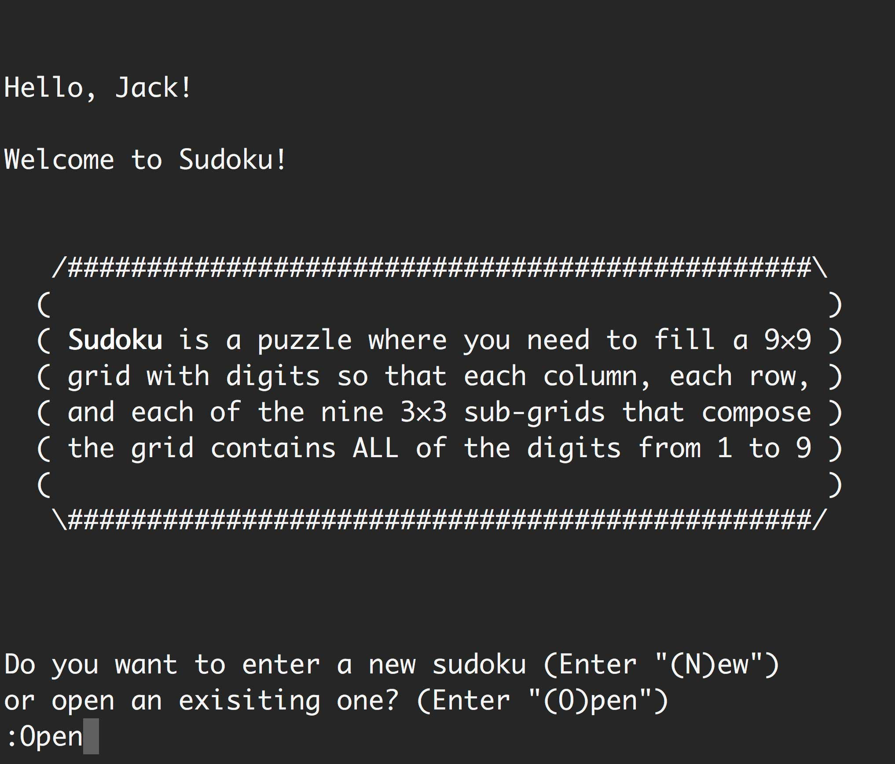

# sudoku

Command-line sudoku game written in Java.

## Motivation

This project is for Object Oriented Programming at NYU Shanghai.

## Screenshots

## License

Sudoku is licensed under the [Apache license](./LICENSE).
